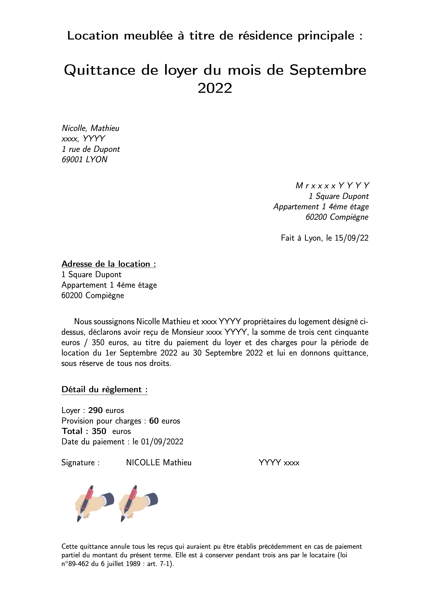

# Automatic-rent-receipt

Create rent receipts required for tax returns each year in France.  
This process takes a CSV file named "input_file.csv" as input data, which represents bank account transactions for a given year.  To save a rent receipt as a transaction, it must be named according to the following convention:  
"Loyer {month} {Mr/Mme/Mlle} {first name} {last name} Chambre {room number} Charge {amounts of charges}". 
For example: "Loyer Septembre Mr xxxx YYYY Chambre 1 Charge 60".
This line in the CSV file will generate the corresponding rent receipt :
An example of an entire CSV file is available at "example_files/input_file.csv".

# Make it yours

Before getting started, please make sure that you have installed Docker Daemon. To use this application, follow these steps: 
1) Clone the Git repository by running this command: git clone https://github.com/mnicolleUTC/automatic-rent-receipt.git 
2) Pull the Docker Images by running this command: docker pull mnicolle/rent_receipt 
3) Navigate to the cloned repository using this command: cd {path_git_repo}  
4) (Optional) Customize your rent receipts by creating an "authentic_files" folder, which should contain your version of "template.tex", "input_file.csv", and your "images" folder that contains signatures. 
5) Run the Docker image by using the following command: docker run -v "$(pwd):/data" mnicolle/rent_receipt  
The output of this command should create a folder named "quittances_out", which will contain all of the rent receipts that have been generated based on the information in your CSV file. 

# Creating your input_file.csv
Here are some tips for creating and saving your CSV file: 
1) Open a new spreadsheet. 
2) Copy the contents of the sheet that corresponds to the desired year. 
3) Paste the copied content into the new spreadsheet. 
4) Change the number format to text for Excel. 
5) Save the file as 'input_file.csv' into your 'authentic_files' folder with the CSV UTF-8 format and comma as the separator. 
6) (Info) : For PRORATA month pay attention to respect following convention = (PRORATA --> 21/01) or (PRORATA 21/01 -->)

# Enjoy and feel free to buy me a coffee
